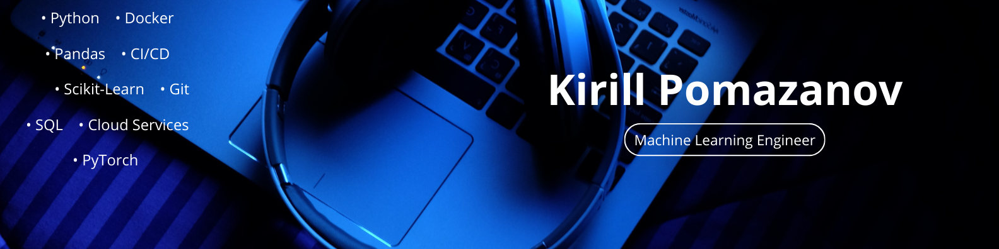

## Hi there 👋 I'm Kirill Pomazanov
🎯 Aspiring **Machine Learning Engineer**

**Open to work**

---

### 🚀 About Me
I am an aspiring Machine Learning Engineer with experience in game development,
Android applications, and web development.

Over the past two years, I have been building a strong foundation in machine learning,
focusing on understanding algorithms, optimization, and practical implementation.
My current goal is to grow as an ML engineer and work on real-world machine learning systems.

Open to junior ML roles and internships.

---

### Core Skills & Tools

---

### 📫 Let’s Connect
)

---

- 🌱 I’m currently learning **Computer Vision**
- 👯 I'm looking for a strong company to work on interesting projects.
- 💬 Ask me about **recommendation system**

⭐ If you’re a recruiter or engineer — feel free to reach out.  
I’m actively building and improving my ML skill set.
